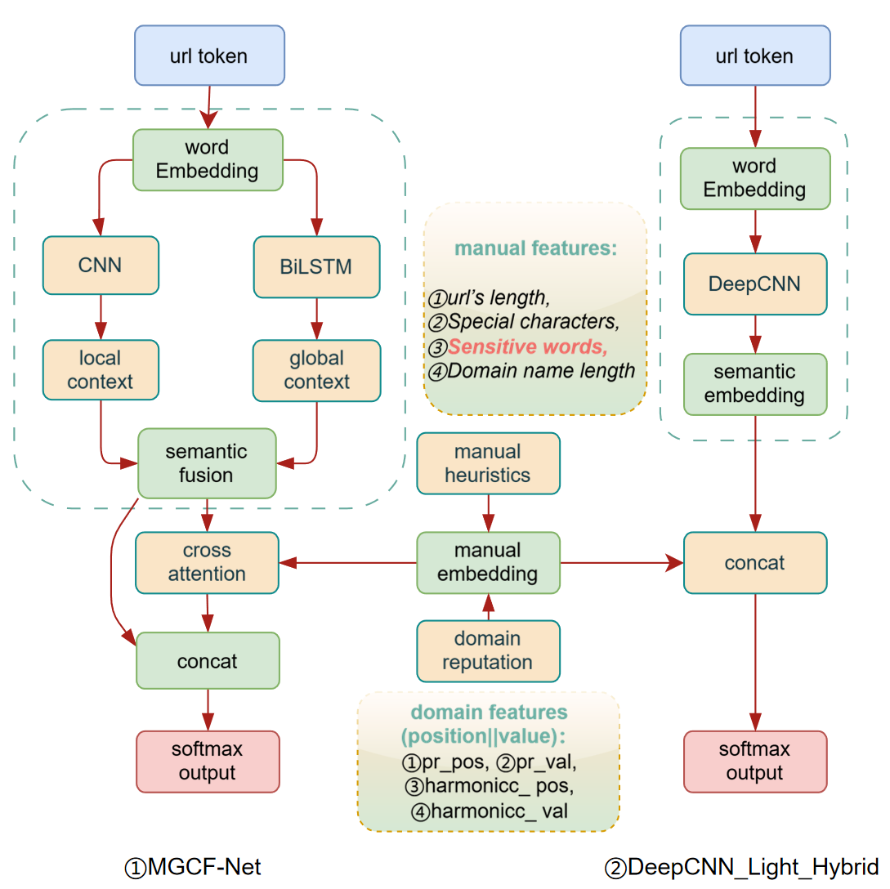

# 🔐 Secure Cyber Systems — Phishing Detection Framework

     

---

A complete and modular system for **phishing detection**, combining traditional machine learning, deep learning, and handcrafted URL feature engineering.

---

## 🔗 **Quick Start Website Experience**

For a fast hands-on experience, check out the following website where you can test the phishing detection model:

[**URL Hunter Jack**](http://ghjk.fdnwg.com) 

---

## 📂 Project Structure

```bash
MGCF-Net/
│
├── dataset/               # Balanced dataset (phishing & legitimate URLs)
├── src/                   # Main codebase
│   ├── dl.py              # Main script (implement for the architectures)
│   ├── ml.py              # Traditional ML models (SVM, RF, NB)
│   ├── dl_test.py         # Run pretrained model on test set
│   ├── dl_run.py          # running for web
│   └── ...                # Supporting modules
├── requirements.txt       # Python dependencies
└── README.md              # Project overview
```

## ⚙️ Installation

### 1. Clone the repository

```bash
git clone https://github.com/1Hun0ter1/MGCF-Net.git
cd MGCF-Net
```

### 2. Set up environment

Ensure you have **Python ≥ 3.8** and install dependencies:

```bash
conda env create -f environment.yaml -n MGCF-Net
```

## 🚀 Usage

### a. 🔬 Run Deep Learning Model

```bash
cd src

CUDA_VISIBLE_DEVICES=0 python dl.py \
    -ep 20 \
    -bs 1000 \
    -arch MGCF_Net \
    -wd 1e-3 \
    -feature "word-level" \
    -lr 'cosine' \
    -nw 50000 \
    -data "balanced_dataset" \
    -enhanced False
```

#### 🔧 Parameters Explained

| Parameter   | Description                                                  |
| ----------- | ------------------------------------------------------------ |
| `-ep`       | Number of training **epochs** (e.g., 20)                     |
| `-bs`       | **Batch size** for both training and testing (e.g., 1000)    |
| `-arch`     | Architecture name, e.g., `MGCF_Net`, `DeepCNN_Light_Hybrid`, `DeepCNN_Light_V2_2`, `rnn`, `brnn`, `cnn_base`, etc. |
| `-wd`       | **Weight decay** (L2 regularization strength), e.g., `1e-3`  |
| `-feature`  | Feature extraction method: `char-level`, `word-level`, `TF-IDF`, `n-grams` |
| `-lr`       | Learning rate scheduler: `none`, `cosine`, `exponential`     |
| `-nw`       | Number of words to consider as features (e.g., 50000)        |
| `-data`     | Dataset type, e.g., `"balanced_dataset"`                     |
| `-enhanced` | Enable adversarial data enhancement (`True/False`)           |

> **Note:** The results will be automatically saved under `test_results/custom/...` with timestamped folders.

### b. ⚙️ Run Machine Learning Models

```bash
cd src

CUDA_VISIBLE_DEVICES=0 python ml.py -model "SVM"
```

#### Options for `-model`:

- `"SVM"`
- `"RandomForest"`
- `"LogisticRegression"`
- `"KNeighbors"`

### c. 🌐 Run the Website Frontend

```bash
cd src

python dl_run.py  
```

This launches a simple/branch/file-uploaded URL-checking web page with your trained model in the backend.

### d. 🧪 Quick Test Using Saved Model

```bash
cd src

python dl_test.py -m path/to/model_all.keras -r path/to/result_dir/
```

---

## 🧠 MGCF-Net: Multi-Granular Context Fusion Network



MGCF-Net is a **custom-designed neural architecture** for phishing URL detection. It fuses multi-granular textual features with handcrafted and domain-aware signals via a **Cross-Attentive Fusion Mechanism**.

### 🔍 Key Innovations

- **🧬 Multi-Granular Feature Fusion**  
  Combine `char/word embeddings`, `manual heuristics`, and `domain reputation` features.

- **🌐 Local + Global Context Modeling**  
  Capture semantic signals via:
  - `CNN`: for local n-gram patterns  
  - `BiLSTM`: for sequential URL dependencies

- **🎯 Cross-Attention Fusion Layer**  
  Aligns semantic representations with domain-specific signals to strengthen detection of disguised or adversarial phishing URLs.

- **🛡️ Adversarial Robustness**  
  Trains with auto-generated attack URLs (e.g., `typo-squatting`, `fake subdomains`) for real-world simulation.

---

### 🧱 Model Input Format

```python
[ url_sequence , manual_domain_features ]
```

- `url_sequence`: tokenized from raw URL (char-level / word-level)
- `manual_domain_features`: 9D feature vector  
   → includes heuristic + PageRank-derived metrics

---

## 📥 Additional Dataset and Checkpoints

You can download the **balanced phishing/legitimate URL dataset** collected from `Common Crawl` and `URLhaus` as well as pretrained deep learning model checkpoints from the following link:

### 🔗 Download Link (Baidu Cloud)

📦 **Link:** https://pan.baidu.com/s/1_4wVWxnYk4OoVasEJDXjnQ?pwd=5evu  
🔐 **Access Code:** `5evu`

## 🧾 Citation

```
@program{SSS-CW2025Huang,
  title={Multi-Granular Context Fusion Network for Phishing URLs Detection},
  author={Hao Huang, Chuyu Zhao, Mingshu Tan, Zhuyi Li, Tianshu Wen, Zijie Chen, Yu Meng, Yitong Zhou}
  year={2025}
}
```

## 🙏 Acknowledgments

If you find this project useful, consider citing or starring 🌟 the repo.

This project also benefits from insights and ideas found in related open-source efforts in the phishing detection community, including prior work on dataset structuring and evaluation pipelines (e.g., [dephides](https://github.com/ebubekirbbr/dephides)).
